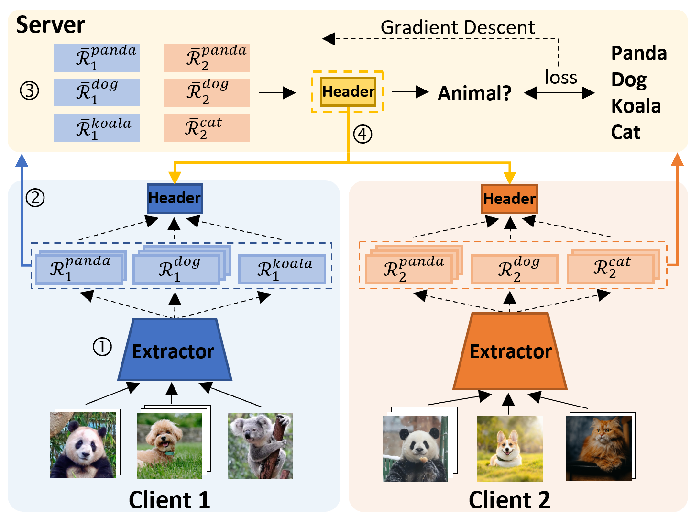

## FedGH: Heterogeneous Federated Learning with Generalized Global Header
This is an official implementation of ***[FedGH: Heterogeneous Federated Learning with Generalized Global Header](https://arxiv.org/abs/2303.13137)*** paper.



#### Installation
- Create a virtual environment with virtualenv
- Clone the repo
- Run: ```cd <PATH_TO_THE_CLONED_REPO>```
- Run: ```pip install -r requirements.txt``` to install necessary packages.

---------

#### Reproduce Paper Results
- Model-homogeneous experiment: ```FedGH.py ```
- Model-heterogeneous experiment: ```FedGH_mh.py ```
---------


#### Citation

If you find FedGH to be useful in your own research, please consider citing the following bibtex:

```bib
@inproceedings{FedGH,
  author    = {Liping Yi and
               Wang Gang and
               Xiaoguang Liu and
               Zhuan Shi and
               Han Yu},
  title     = {{FedGH: Heterogeneous Federated Learning with Generalized Global Header}},
  booktitle = {AM Multimedia},
  year      = {2023},
}
```
